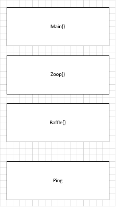

# Trace Program

``` java
public static void main(String[] args) {                (1)
    zippo("rattle", 13);                                (2)
}                                                                     (18)
```

```java
public static void baffle(String blimp) {                   (8)
    System.out.println(blimp);                              (9)
    zippo("ping", -5);                                      (10)
}                                                                (14)
```

```java
public static void zippo(String quince, int flag) {     (3) (11)
    if (flag < 0) {                                     (4) (12)
        System.out.println(quince + " zoop");               (13)
    } else {                                            (5)
        System.out.println("ik");                       (6)
        baffle(quince);                                 (7)
        System.out.println("boo-wa-ha-ha");                      (15)
    }                                                            (16)
}                                                                (17)
```

Write the number 1 next to the first line of code in this program that will execute.
Write the number 2 next to the second line of code, and so on until the end of the program. If a line is executed more than once, it might end up with more than one number next to it.

What is the value of the parameter blimp when baffle gets invoked?

```java
"rattle"
```

What is the output of this program?

```java
"ik"
"rattle"
"ping zoop"
"boo-wa-ha-ha"
```

## Exercise 3

Answer the following questions without running the program on a computer.

1. Draw a stack diagram that shows the state of the program the first time ping is invoked.



2. What is output by the following program? Be precise about where there are spaces and where there are newlines.

```java
No, I wug.
You wugga wug.
I wug.
```

```java
public static void zoop() {
    baffle();
    System.out.print("You wugga ");
    baffle();
}

public static void main(String[] args) {
    System.out.print("No, I ");
    zoop();
    System.out.print("I ");
    baffle();
}

public static void baffle() {
    System.out.print("wug");
    ping();
}

public static void ping() {
    System.out.println(".");
}
```

## Exercise 4

1. There will be a warning hinting on the return value is unused.
2. The compiler will produce a syntax error stating that it is not a valid statement.

## Exercise 5

**Output**

```java
* is a space
just*for
any*not*more*
It's breakfast !
```