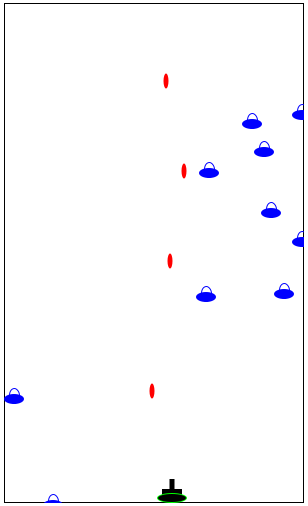

# How to Code: Simple Data Final Project - Space Invaders

## Table of contents

- [How to Code: Simple Data Final Project - Space Invaders](#how-to-code-simple-data-final-project---space-invaders)
  - [Table of contents](#table-of-contents)
  - [Introduction](#introduction)
  - [Example Gameplay Image](#example-gameplay-image)
  - [Project Objectives](#project-objectives)
  - [Design specifications](#design-specifications)
    - [How the program will behave](#how-the-program-will-behave)
    - [Functions Outline](#functions-outline)
  - [Overall structure diagram](#overall-structure-diagram)
  - [Credits](#credits)

## Introduction

This project is a clone of the space invaders game, developed using Beginning Student Language (BSL).

## Example Gameplay Image

## Project Objectives

To improve proficiency in developing programs throughout the whole planning, implementation, and coding phases.

## Design specifications

### How the program will behave

The program should behave like a space invaders game.

Upon starting the game with `(main G0)`, the game should start randomly generating invaders that move at a 45 degrees
angle that attempts to `invade` the player's land by reaching the bottom of the window.

The player is responsible to move the spacecraft, and shoot missiles at the invaders to vanquish them and stop them from
successfully invading the player's land.

When the invaders touch the bottom of the screen, the players lose and the game ends.

### Functions Outline

The program should consists of 4 different main function:

1. Game engine
2. This function should handle all activities to prepare the next frame (or picture) to be rendered on screen.
3. For example, this function should update the location of all the sprites (or elements) on screen on every tick, and
also randomly generate new invaders.
2. Renderer
1. This function should render (or put) the new frame (or picture), generated from the "Game Engine" function on the
screen on every tick.
3. Control
1. This function should handle all the controls and input from the user.
2. For example: the direction of the tank is moving towards, and the firing of the missiles
4. Game over
1. This function should decide whether or not to end the game.

## Overall structure diagram

- [Space Invaders Structure Chart](space-invaders-sc.pdf)
- [Editable version (Visio)](space-invaders-sc.vsdx)

## Credits

This game is heavily inspired by:

- the original developer of Space Invaders, Tomohiro Nishikado & Taito
- How to Code: Simple Data final year project specification